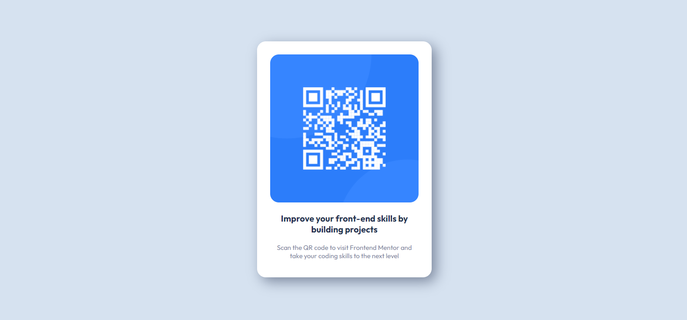

# Frontend Mentor - QR code component solution

This is a solution to the [QR code component challenge on Frontend Mentor](https://www.frontendmentor.io/challenges/qr-code-component-iux_sIO_H). Frontend Mentor challenges help you improve your coding skills by building realistic projects. 

## Table of contents

- [Overview](#overview)
  - [Screenshot](#screenshot)
  - [Links](#links)
- [My process](#my-process)
  - [Built with](#built-with)
  - [What I learned](#what-i-learned)
  - [Continued development](#continued-development)

## Overview
Simple page with QR code component.

### Screenshot

### Links
- [Solution URL here](https://github.com/KamilaHareza/Qr-component/tree/main)
- [Live site URL here](https://kamilahareza.github.io/Qr-component/)

## My process

### Built with
- HTML5
- CSS
- Flexbox

### What I learned
This project let me refresh my basic knowledge about Flexbox, CSS and HTML5, so I can move on to creating more complex pages with the usage of  CSS grid. It's also my first time creating README.

### Continued development
I want to play around with CSS grid, media queries and semantic HTML to feel more comfortable with it. I have basic understaning of JS, so most of all I want to start using it, to create interacive pages.
